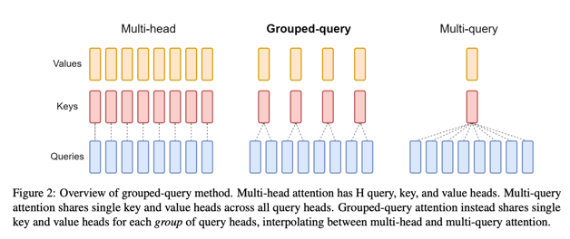
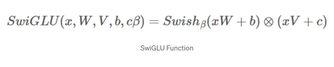
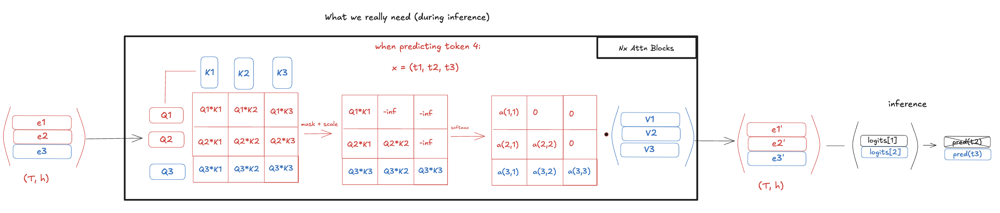
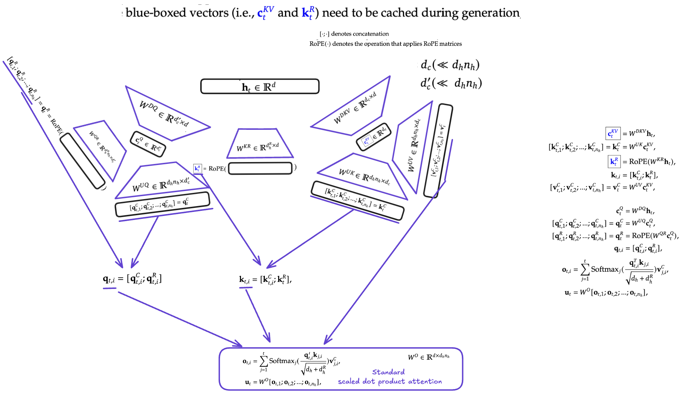
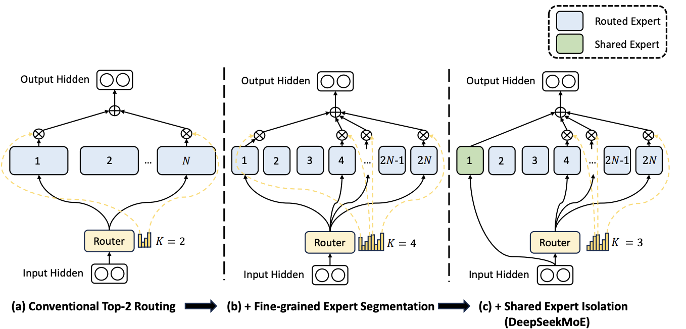
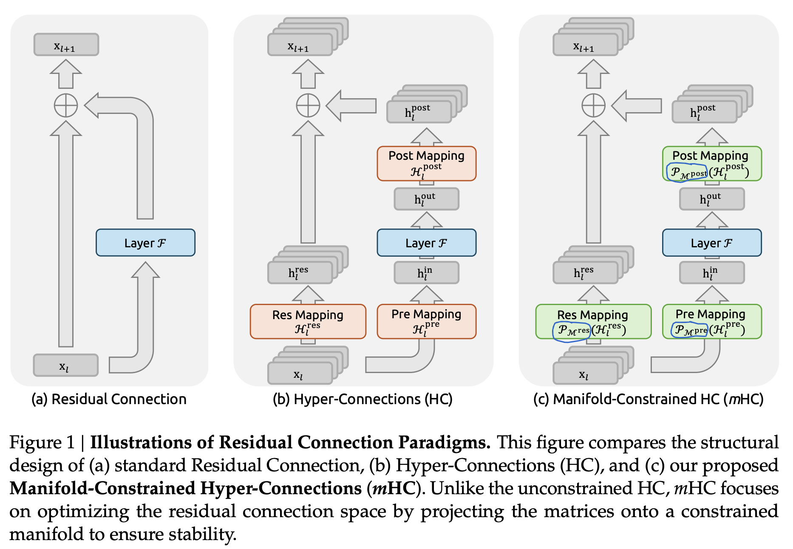
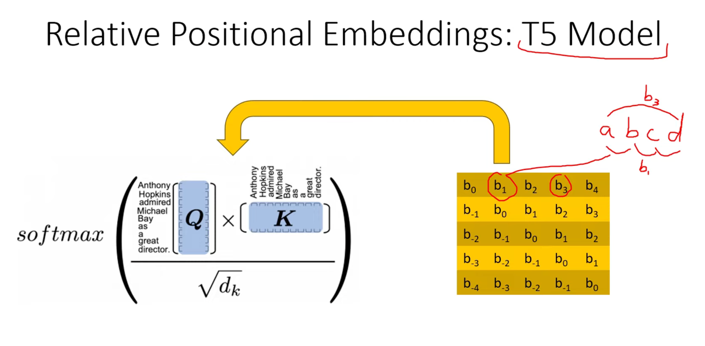

# Paper Architecture Implementations

Custom Implementations of various (transformer) deep learning architectures. Created while reading papers on Large Language Models. 
There is no training code here—just the models, attention mechanisms, and building blocks, written in  PyTorch.

---

## What is inside?

| Module                | What it implements                                                                                 |
|-----------------------|----------------------------------------------------------------------------------------------------|
| **Llama 3**           | Full transformer decoder with Grouped Query Attention, SwiGLU FFN, RMSNorm, RoPE, and KV caching   |
| **DeepSeek-V2**       | Multi-Head Latent Attention (low-rank compressed KV cache) + Mixture-of-Experts routing            |
| **Linear Attention**  | Kernel-based attention that drops the quadratic cost via feature maps and running sums             |
| **Hedgehog**          | Learnable linear attention that distills a standard softmax attention layer into fast feature maps |
| **mHC**               | Manifold-Constrained Hyper-Connections using doubly-stochastic Sinkhorn-Knopp activations          |
| **Rotary Embeddings** | RoPE precomputation and application, including YaRN-style long-sequence scaling for MLA            |

---

## Repository Layout

```
core/
├── nn/
│   ├── llama3/              # Llama 3 decoder
│   ├── deepseekv2/          # MLA + MoE
│   ├── linearAttention/     # Kernelized linear attention
│   ├── hedgehog/            # Learnable linear attention distillation
│   ├── mHC/                 # Dynamic Sinkhorn routing
│   ├── lora/                # (reserved)
│   └── quantization/        # (reserved)
├── pos_embed/               # RoPE and long-context variants
├── norm/                    # RMSNorm
├── utils/                   # Hyperparameter dataclasses & device helpers
└── einsum/                  # Einsum notes and helpers
```

## Papers & References

| Module           | Paper / Source                                                                                              |
|------------------|-------------------------------------------------------------------------------------------------------------|
| Llama 3          | [Llama 3](https://github.com/meta-llama/llama3)                                                             |
| DeepSeek-V2      | [DeepSeek-V2: A Strong, Economical, and Efficient Mixture-of-Experts Language Model](https://arxiv.org/abs/2405.04434) |
| Linear Attention | [Transformers are RNNs: Fast Autoregressive Transformers with Linear Attention](https://arxiv.org/abs/2006.16236) |
| Hedgehog         | [The Hedgehog & the Porcupine: Two Linear Attention Models](https://arxiv.org/abs/2310.18680)               |
| mHC              | [mHC: Manifold-Constrained Hyper-Connections](https://arxiv.org/abs/2512.24880)                             |

## Llama 3

The `core/nn/llama3/` folder contains a complete Llama-style decoder stack. It is composed of stacked transformer blocks that each apply pre-normalization, grouped-query self-attention, and a SwiGLU feed-forward network.

<p align="center">
  
</p>

**Grouped Query Attention** reduces memory bandwidth during inference by sharing key and value heads across query heads, then broadcasting them back up before the attention computation.

<p align="center">
  
</p>

The **SwiGLU** activation uses a gating mechanism for the FFN. The hidden dimension is computed from the model dimension with a multiplier and rounded to a hardware-friendly multiple.

<p align="center">
  
</p>

A standard **KV cache** is implemented so that, after the initial prompt, each new token only attends to previously cached keys and values rather than recomputing the full sequence.

<p align="center">
  
</p>

---

## DeepSeek-V2

### Multi-Head Latent Attention (MLA)

Instead of caching full key and value tensors, MLA compresses keys and values into a low-rank latent vector. It also decouples positional information into a small rotary component so the bulk of the cache stays tiny.

<p align="center">
  
</p>

During inference, only the compressed latent and the small decoupled rope keys need to be stored and updated, which drastically reduces memory usage compared to standard MHA or even GQA.

### Mixture-of-Experts (MoE)

The MoE layer routes each token to a small subset of experts. The router first scores all experts, applies group-level masking to limit which groups can participate, and then selects the top-k experts within the allowed groups.

<p align="center">
  
</p>

Shared experts always run, while routed experts are sparsely activated. The final output is a weighted sum of the selected expert outputs plus the shared expert output.

---

## Linear Attention

Standard softmax attention scales quadratically with sequence length. Linear attention replaces the softmax with a feature map, which lets you reorder the matrix multiplications and reduce complexity.

<p align="center">
  
</p>

---

## Hedgehog

Hedgehog is a method for learning a linear attention feature map that mimics a pretrained softmax attention layer. Rather than hand-designing a kernel, you freeze the base attention module and train a small feed-forward feature map on each head.

<p align="center">
  
</p>

---

## m-HyperCell (mHC)

mHC is a dynamic routing block that maps channels many-to-many using weights generated on the fly from the input itself. It wraps an existing layer (such as a linear projection or attention block) and routes information through it via learnable gating.

<p align="center">
  
</p>

The routing weights are kept doubly-stochastic—every row and column sums to one—using the Sinkhorn-Knopp algorithm. This ensures a balanced, permutation-like routing rather than collapsing to a single dominant channel.

<p align="center">
  
</p>

---

## Rotary Positional Embeddings & Normalization

`core/pos_embed/` and `core/norm/` hold the smaller primitives:
- **RoPE** — precomputes complex rotation frequencies and applies them to queries and keys.
- **YaRN-scaled RoPE** — a variant used by MLA that interpolates frequencies for long-context extension.
- **RMSNorm** — root-mean-square normalization without mean-centering.

<p align="center">
  
</p>


