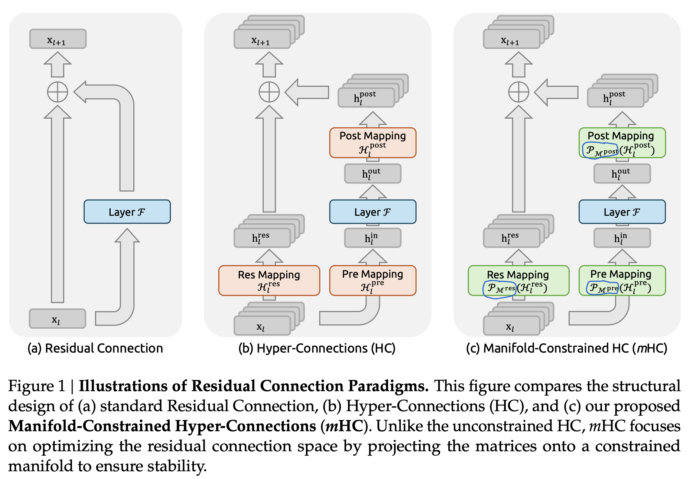
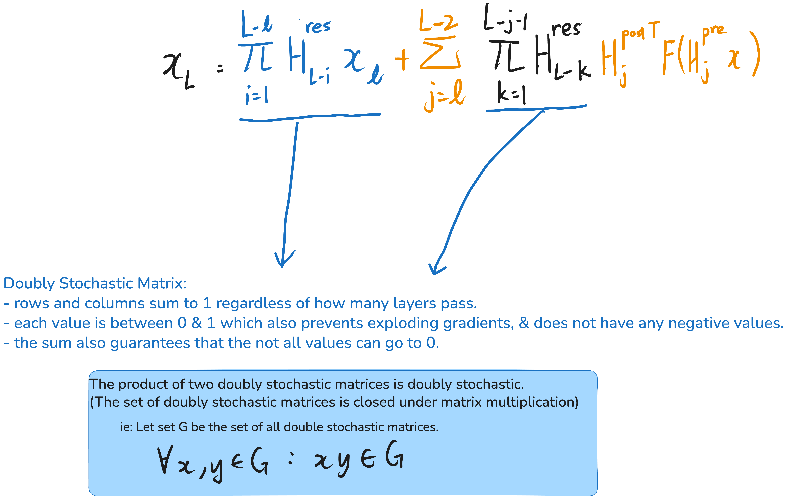

paper:

- https://arxiv.org/pdf/2512.24880

# Architecture

- dynamic hyper-connection variant (H is "dynamically" generated and not a pre-learnt weight.)
  

# Problems of HC architecture.

# Solution

