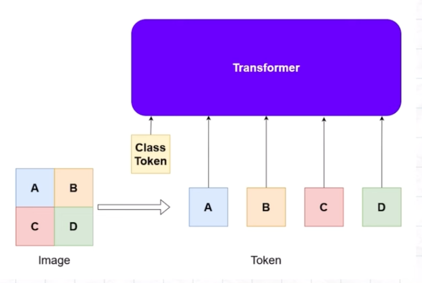
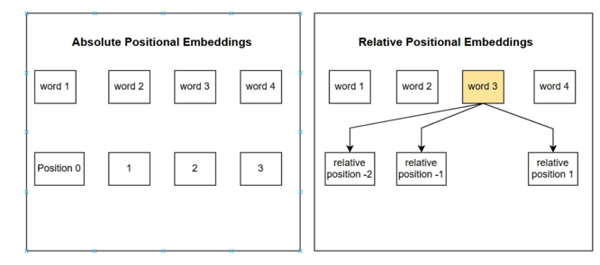
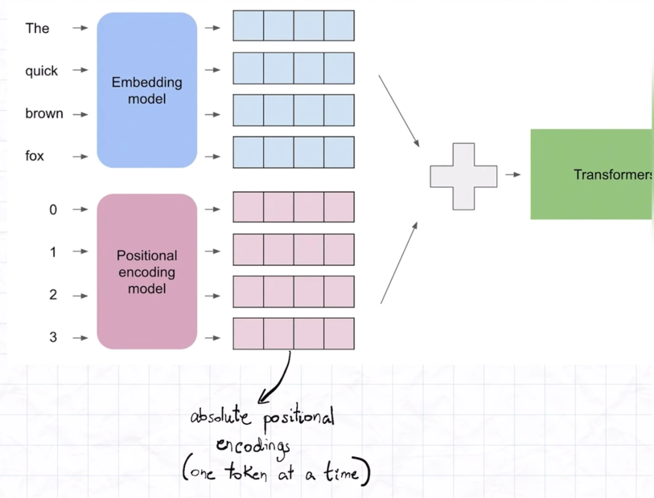
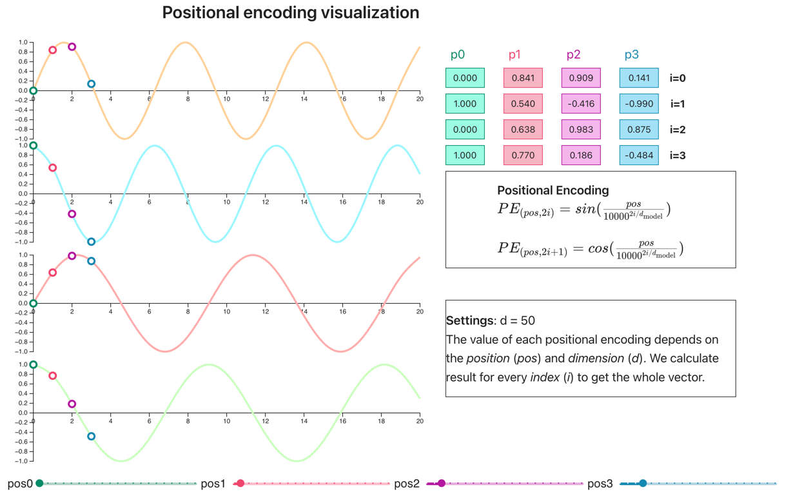
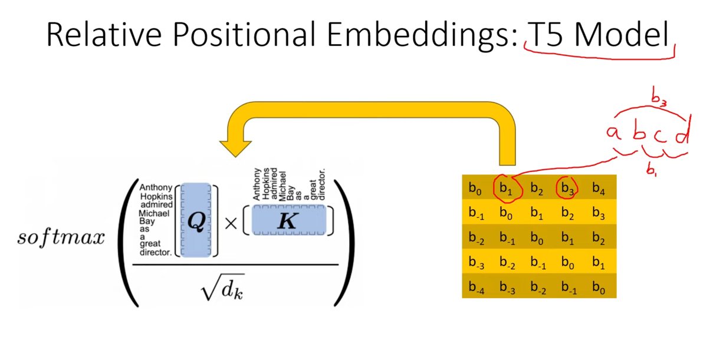

# Background

Image patches are fed into transformer and processed in **parallel**.
Which means it loses the positional information.

Hence, Positional Information must be *embedded* into the input tokens themselves.
The transformer will learn via backprop to distinguish each patch.
Each position must have a unique value to uniquely identify each position.

There are 2 types of positional embeddings:

1. Absolute Positional Embeddings
2. Relative Positional Embeddings

## Absolute Positional Embeddings

 

https://youtu.be/Kv90HQY9lZA?si=KaDv-KQlDz23cpym

Problems:

- Dont capture relative positions between tokens (ie, diff between t1 & t4 is not proportional etc)
- Difficult to generalize beyong the max length
- Sinusoidal Embeddings have weak extrapolation abilities
- Lack clear geometric interpretation: harder for models to reason about token distances

### Example: Sinusoidal Embedding

source: https://erdem.pl/2021/05/understanding-positional-encoding-in-transformers

Basically it is binary but in continuous form.
This can ensure that no token will have the exact same value for each dimension.
Note that it is possible to be the same, but it can be prevented by having more dimensions and smaller sampling
intervals/higher d.

## Rotary Positional Embeddings (ROPE)

https://youtu.be/o29P0Kpobz0?si=Kv1inH2JIAM__Qt8
https://www.youtube.com/watch?v=Kv90HQY9lZA&t=5s

Complex space:

- Angle is changed while vector magnitude is preserved.
- Each complex number has a unique polar representation, so each vector remains distinct.
- Complex plane is smooth and continuous so vectors do not collapse into one another.